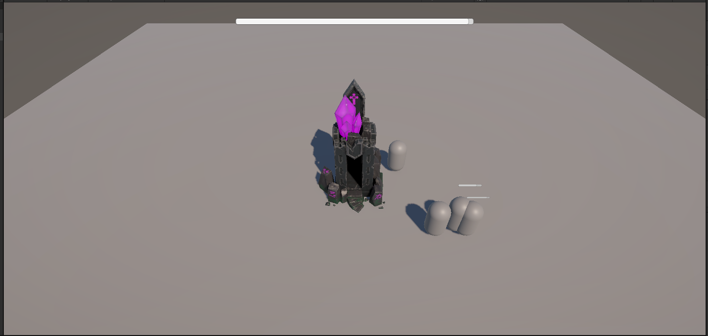

# Hell Tower

Технический прототип мобильной игры в жанре **Action Roguelike + Tower Defense**, создаваемый в Unity 6 с использованием Codex как основного AI-инструмента разработки.

> Статус: ранний рабочий прототип. Визуальные элементы и баланс являются временными и используются для проверки механик.

## Демонстрация

▶ **[Посмотреть техническую демонстрацию (MP4, 27 секунд)](HellTower_Portfolio_Demo.mp4)**

В видео показаны движение персонажа, поведение группы противников, изменение здоровья CoreTower и условие поражения при уничтожении башни.

## Концепция

Игрок управляет антигероем, защищающим центральную башню. Обычные противники идут к CoreTower, но могут переключиться на Player, если тот входит в их зону агрессии. Герой атакует только во время остановки, поэтому игроку приходится выбирать между перемещением и нанесением урона.

## Что уже реализовано

- передвижение Player с блокировкой атаки во время движения;
- поиск ближайшего Enemy и автоматическая атака после остановки;
- снаряд, который движется к выбранной цели и наносит урон при достижении;
- здоровье и смерть Player и Enemy;
- World Space полоски здоровья персонажей;
- движение Enemy к CoreTower через NavMesh;
- переключение цели Enemy между CoreTower и Player по зоне агрессии;
- подготовка атаки, отмена удара при выходе цели и повторный запуск цикла;
- здоровье CoreTower и постоянный индикатор в HUD;
- завершение боя при уничтожении CoreTower;
- базовые эффекты попадания и временные анимации атаки.

## Моя роль

Я не позиционирую себя как разработчика, самостоятельно написавшего весь код проекта.

Моя работа в AI-assisted процессе:

1. формулировать механику и ожидаемое поведение объектов;
2. разбивать задачу на небольшие проверяемые этапы;
3. ставить задачи Codex и уточнять требования;
4. интегрировать полученные C#-скрипты и настройки в Unity;
5. воспроизводить ошибки и описывать фактическое поведение;
6. проверять результат в разных игровых ситуациях;
7. откатывать нерабочие изменения и проводить следующую итерацию.

Codex создаёт и объясняет код на основе поставленных задач. Я отвечаю за игровую идею, требования, интеграцию, функциональную проверку и принятие результата.

## Инструменты

- Unity 6.5 (`6000.5.0f1`)
- C# — начальный уровень
- Visual Studio 2022
- Git и GitHub Desktop — базовый уровень
- Codex

## Следующие этапы

- базовая система защитных башен;
- размещение башен в разрешённой зоне;
- волны противников и фаза подготовки;
- разные приоритеты целей для типов Enemy;
- дальнейшая работа над интерфейсом, балансом и визуальной читаемостью.

## Ограничения публикации

Репозиторий используется как демонстрация процесса и текущего результата. Полный Unity-проект и сторонние графические ассеты не публикуются.
